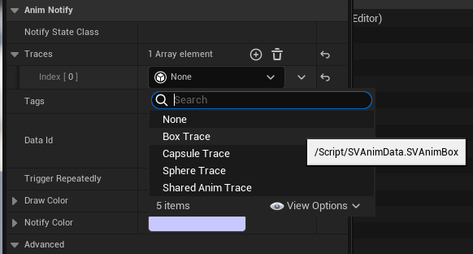
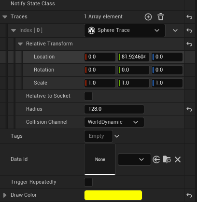
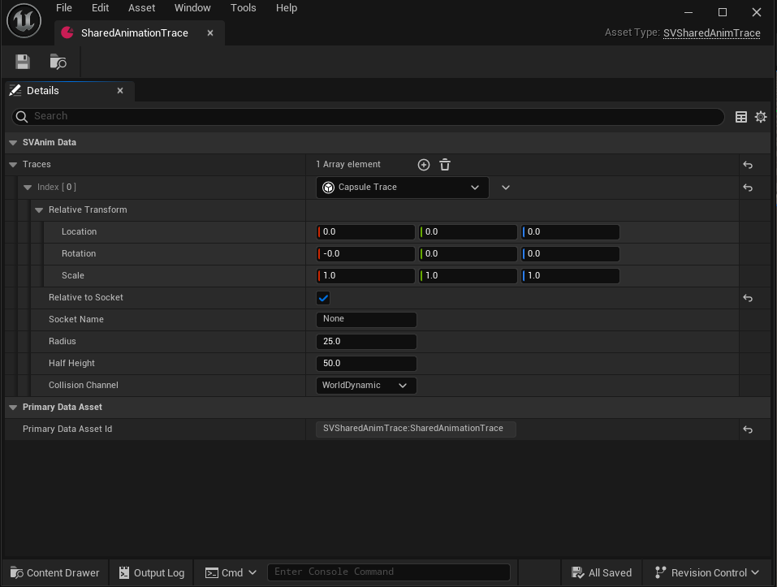

A rough and tumble version of hitbox / hurtbox traces for animations in unreal.

# How to use:

- Put the plugin into your plugins folder
- Implement the `SVAnimAvatar` interface in your pawn Blueprint or C++ class
    - it contains a single event `HandleAnimTraceHit` which will report the trace hits from any animations playing on any skeletal meshes attached to the pawn
- Open any animation you'd like to have hit / hurt boxes, and add a `SVAnimNotifyState_Trace` Anim Notify State to the animation. And configure the traces inside.

## Montage Support
 Montages are strange and complicated things. If you scrub within Montages it does not tick `AnimNotifyState`s but it does in the animation sequence editor. 
 
 There for, to edit traces within persona, use the `bAlwaysDrawInPersona` variable to place the traces where you want. And uncheck it when you're done.

## SVAnimNotifyState_Trace

The notify state can hold two categories of traces,
-  Shared Traces:  that take their definitions from a `SVSharedAnimTrace` data asset.
- Inline Traces: defined within the Notify State.

The inline trace definitions and the shared trace definitions use the same structs.

There are 3 inline traces:
- Box
- Sphere
- Capsule

## Trace Options

- Use `RelativeTransform` to move the traces relative to the mesh / bones / sockets
- Use the `bRelativeToSocket` to attach the traces to bones / sockets
- Use `CollisionChannel` to set the channel the trace uses
- The `Tags` and `DataId` fields are passed to the `SVAnimAvatar` upon hit. You can use this to identify hit vs hurt boxes or to lookup damage types and values via data assets.
    - The `DataId` can be *any* `PrimaryDataAsset`
- `bTriggerRepeatedly` (false by default) can be used to trigger the hit every frame of the animation, instead of just the first time the overlap happens.

## SVSharedAnimTrace 

A `PrimaryDataAsset` to define traces once, and share them across notify states / animations. Create them and make sure they are loaded in game / editor, then use the `Shared Anim Trace` option in the notify states and select the definition you want to use. Updating the `SVSharedAnimTrace` will reflect it's changes in the animation editor instantly.

## Debug Options
- Use the plugin settings or the connected `SV.Anim.DrawDebug` cvar to toggle debug drawing across the entire plugin

